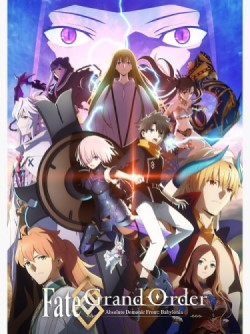

# Select Your Fate!
Now that your here, it is time for a quick breakdown from me, your helpful anime guy! I would sugguest you start with zero, then move onto stay night since zero techinally happens before night, but it really doesn't matter what order you follow. And with grand order you can just watch that without anything since it's story connects with the mobile game. I would try to explain their story but even me, the great anime guy can barely understand fate lore, so just go ahead and watch it and find out! Anyways enough rambling, go on pick your fate! ps. beware of ads when watching through my link, free stuff always comes at a cost :D
## Fate/Zero
  
[Start your binge!](https://animekisa.tv/fate-zero)

## Fate/stay night:ubw
  
[Start your binge!](https://animekisa.tv/fate-stay-night-unlimited-blade-works)

## Fate/Grand Order:Babylonia
  
[Start your binge!](https://animekisa.tv/fate-grand-order-zettai-majuu-sensen-babylonia)

[Start Over](../../README.md)  
[Go back](../fantasy.md)

